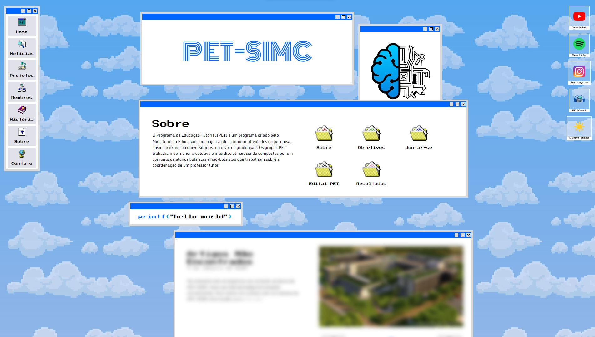
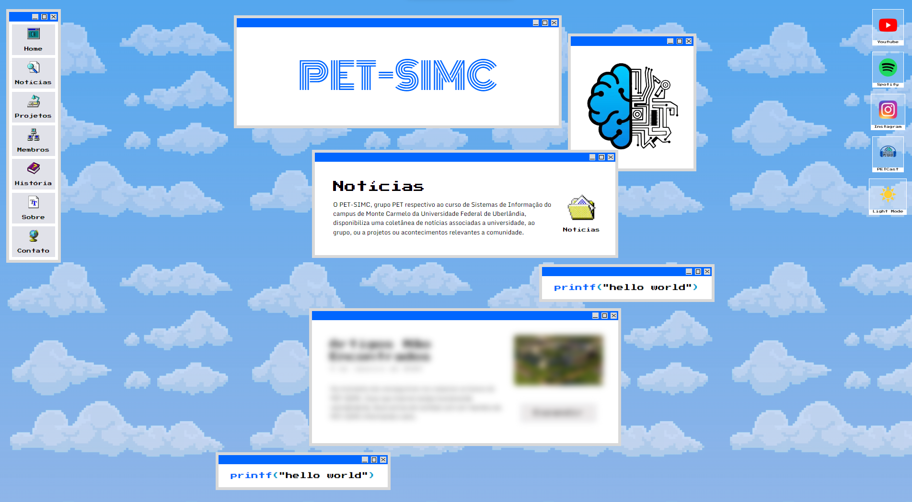
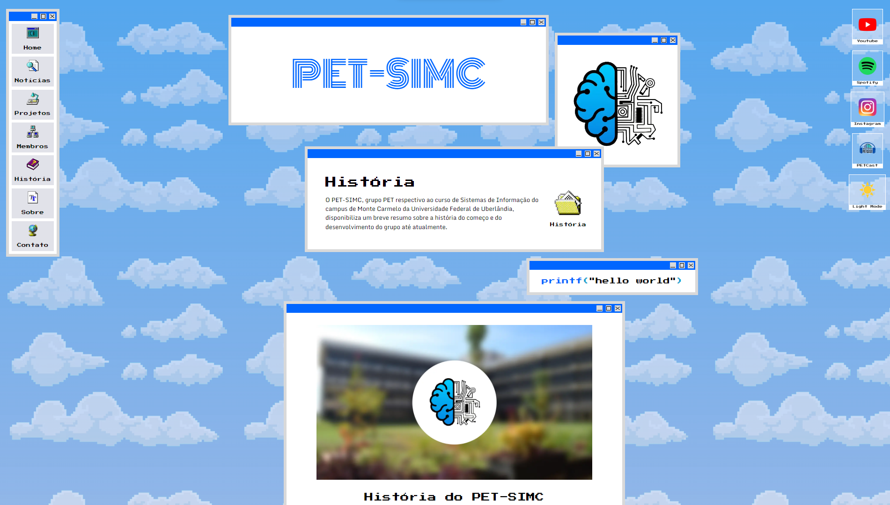
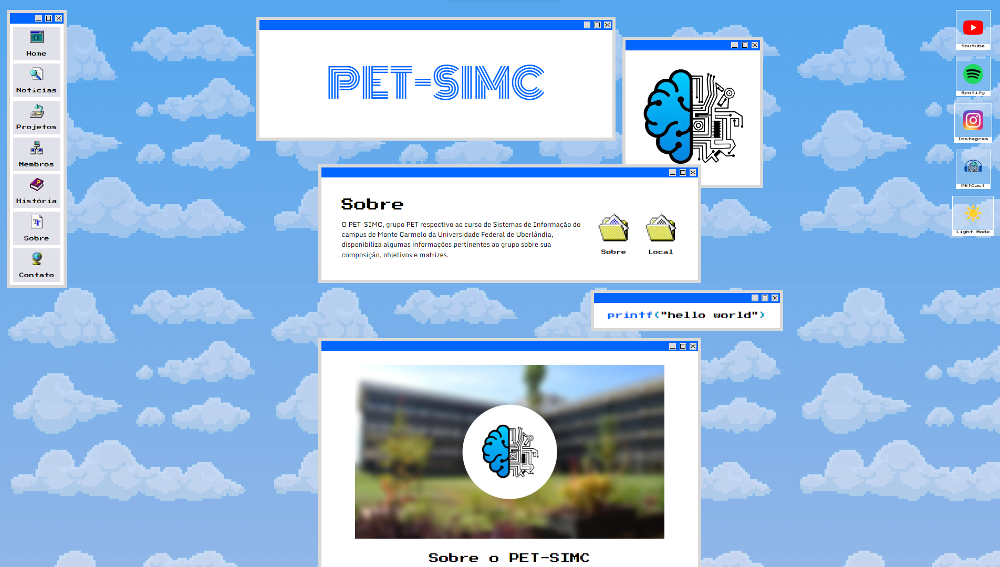
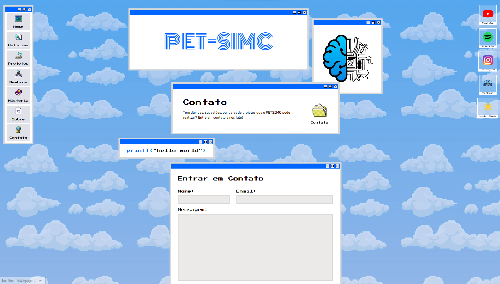

# PETSITEv2

PETSITEv2 it's an app created to show information, members, news, and else about PET-SIMC using [PETAPI](https://github.com/ImNotPETSIMC/PETApi) to retrieve information. 

-----

# Getting Started

First, run the server:

```bash
yarn dev
```

Open [http://localhost:3000](http://localhost:3000) with your browser to see the result.

-----

# PETSITEv2

<h1>Pages:</h1>

<ul>
    <li>Home Page: Displays introduction information about PET-SIMC and latest news.</li>
    <li>News Page: Displays all PET-SIMC's registered news.</li>
    <li>Projects Page: Displays all PET-SIMC's registered projects.</li>
    <li>Members Page: Displays all PET-SIMC's registered members and ex-members.</li>
    <li>History Page: Displays a short summary about PET-SIMC's history.</li>
    <li>About Page: Displays a short summary about PET-SIMC.</li>
    <li>Contact Page: Displays a contact form to send messages to PET-SIMC.</li>
</ul>

-----

<h3>Home Page</h3>
></img>
Displays introduction information about PET-SIMC and latest news.

-----

<h3>News Page</h3>
></img>
Displays all PET-SIMC's registered members and ex-members.

-----

<h3>Projects Page</h3>
></img>
Displays all PET-SIMC's registered members and ex-members.

-----

<h3>Members Page</h3>
></img>
Displays all PET-SIMC's registered members and ex-members.

-----

<h3>History Page</h3>
></img>
Displays a short summary about PET-SIMC's history.

-----

<h3>About Page</h3>
></img>
Displays a short summary about PET-SIMC.

-----

<h3>Contact Page</h3>
></img>
Displays a contact form to send messages to PET-SIMC.

